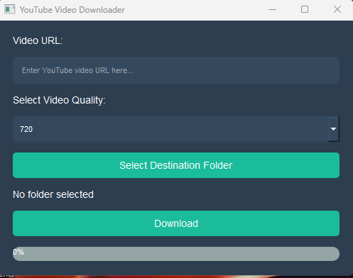

# YouTube Video Downloader

A simple yet elegant **YouTube Video Downloader** built using `PyQt5` and `yt-dlp`. This application allows users to download YouTube videos in different resolutions, select a destination folder, and monitor real-time progress of the download process. 

## Features
- **Video URL Input**: Users can paste the YouTube video URL to download.
- **Dynamic Video Quality Selection**: Choose from multiple video resolutions (720p, 1080p, 1440p, 2160p).
- **Destination Folder**: Select a folder to save the downloaded videos.
- **Real-time Progress**: A progress bar that updates as the video downloads.
- **Completion and Error Dialogues**: Users will be notified upon successful download or if any error occurs during the process.
- **Elegant UI**: The application has a modern, stylish UI using `PyQt5` stylesheets.

## Requirements

- Python 3.6+
- `PyQt5`
- `yt-dlp`

## Installation

1. Clone this repository:
    ```bash
    git clone https://github.com/your-username/yt-video-downloader.git
    cd yt-video-downloader
    ```

2. Install the required dependencies:
    ```bash
    pip install requirements.txt
    ```

3. Run the application:
    ```bash
    python downloader.py
    ```

## Usage

1. Open the application.
2. Paste the YouTube video URL in the "Video URL" field.
3. Select the desired video quality (720p, 1080p, etc.).
4. Choose a destination folder by clicking "Select Destination Folder".
5. Click "Download" to start downloading the video.
6. Watch the progress bar as the video downloads.
7. Upon completion, a dialogue box will notify you, or an error message will appear if something went wrong.

## Screenshots



## License

This project is licensed under the MIT License - see the [LICENSE](LICENSE) file for details.

## Acknowledgements

- [PyQt5](https://www.riverbankcomputing.com/software/pyqt/intro) for creating the GUI.
- [yt-dlp](https://github.com/yt-dlp/yt-dlp) for the awesome YouTube downloader functionality.

---

Feel free to contribute to this project by submitting issues or pull requests!
